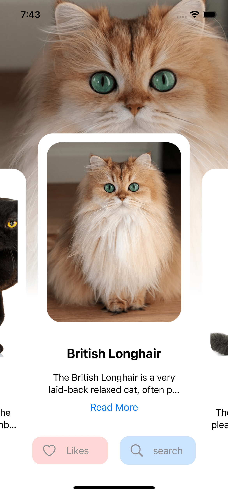

# TheCat

This program retrieves information from an API to provide users with information about cats. Users can add cats they like to their favorites to look after later. It is an application where you can search for the cat breed you want to find within the application.

## Installation

This key (x-api-key) lets you navigate to the API and make specific requests.

To perform this action, go to "https://thecatapi.com" and register. You will be provided with an API key. Once you have your key you can use it in your project.

## Usage

The application opens and retrieves data from an API. The main menu includes an information page about cats. Clicking on the "Read More" button directs us to a detail page with more detailed information about cats. At the bottom of the screen, there is a search button that is used to search for the cat breeds we are looking for. Additionally, there is a like button at the bottom of the screen where we can see the cats we like. To like a cat, we need to click on the empty heart icon in the upper right corner of the detail page. Clicking again is enough to remove them from our liked cats list.

